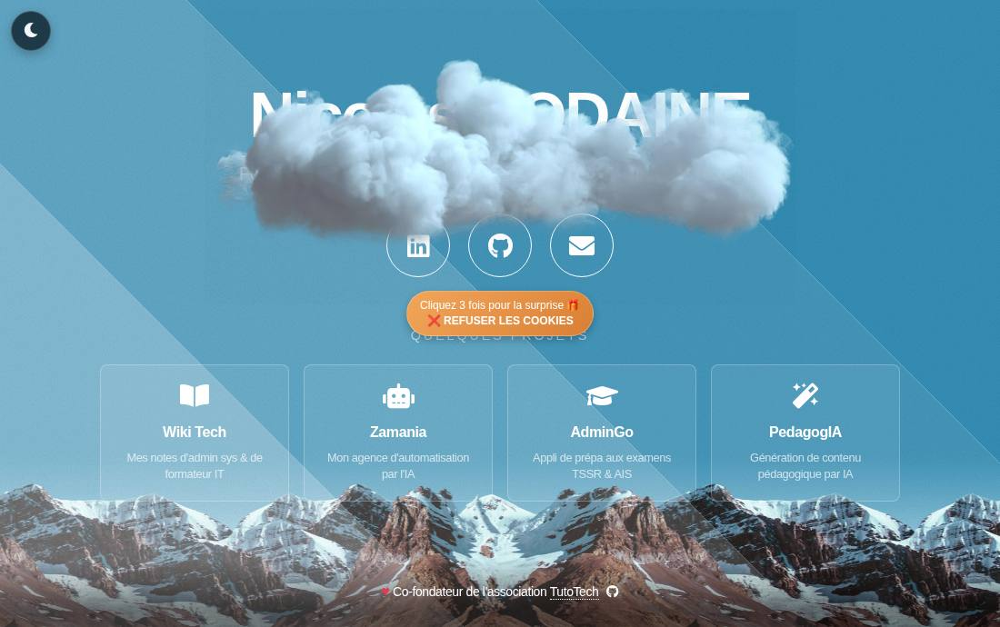
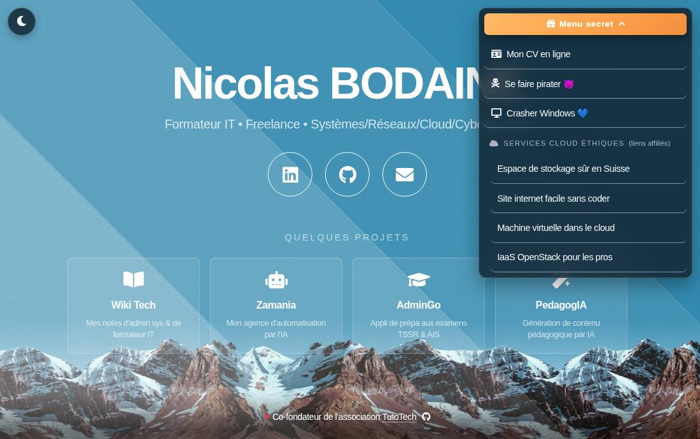
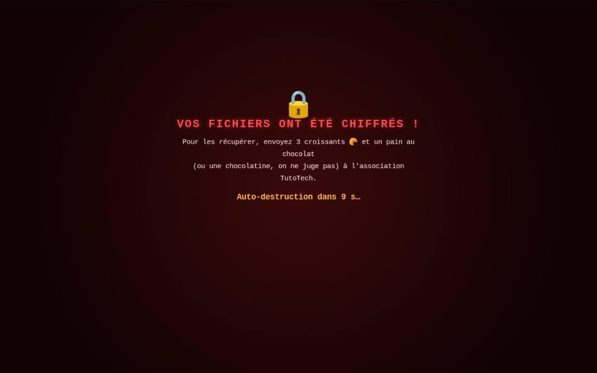
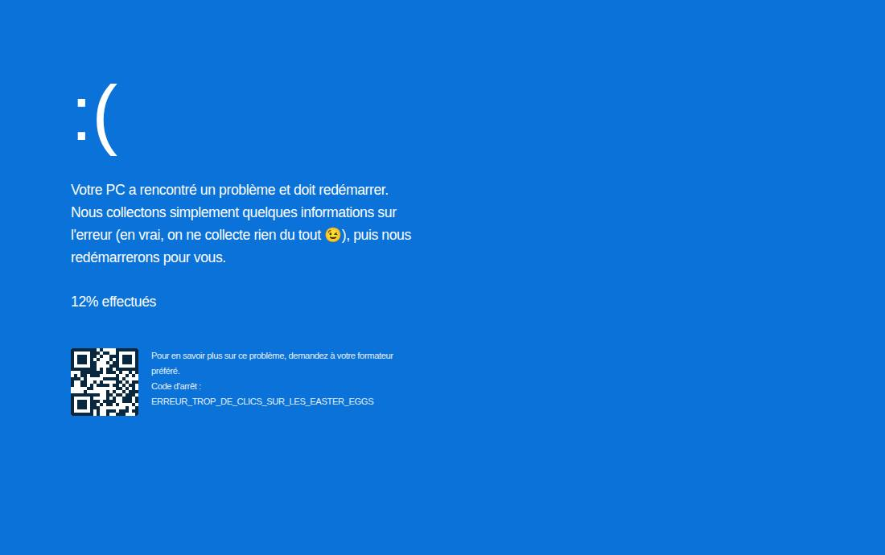

# 🏔️ bodaine.fr — Site personnel de Nicolas Bodaine

[](https://github.com/NicoBOD/website-bodaine/actions/workflows/ci.yml)
[](https://bodaine.fr)

Carte de visite en ligne de **Nicolas Bodaine**, formateur IT freelance spécialisé en
systèmes, réseaux, cloud et cybersécurité — avec une bonne dose d'easter eggs cachés. 🥚



## ✨ Fonctionnalités

- **100 % statique** : HTML, CSS et JavaScript vanilla, sans framework ni build — tout
  tient dans `index.html` et `assets/css/main.css`
- **Responsive** : centrage vertical quand le contenu tient à l'écran, défilement fluide sinon
- **Mode sombre** 🌙 : bouton lune/soleil, préférence mémorisée (`localStorage`) avec repli
  sur `prefers-color-scheme`
- **Sous-titre machine à écrire** avec curseur clignotant, sans décalage de mise en page
  (un « texte fantôme » réserve l'encombrement final)
- **Parallaxe** légère du contenu au mouvement de la souris (ordinateurs uniquement)
- **Effets saisonniers** : neige ❄ (décembre-février), feuilles mortes 🍂 (septembre-novembre),
  pétales 🌸 (mars-avril) — prévisualisables toute l'année via `?saison=hiver|automne|printemps`
- **Page 404 personnalisée** aux couleurs du site
- **Données structurées** JSON-LD (schema.org `Person` + `Organization`)
- **Accessibilité** : navigation au clavier, libellés ARIA, textes pour lecteurs d'écran,
  animations désactivées si `prefers-reduced-motion`
- **Cartes projets** : [Wiki Tech](https://wiki.bodaine.fr/), [Zamania](https://zamania.fr/),
  [AdminGo](https://admingo.tutotech.org/) et [PedagogIA](https://pedagogia.bodaine.fr/)

## 🥚 Easter eggs

> ⚠️ **Attention, spoilers !** La moitié du plaisir, c'est de les trouver soi-même…

<details>
<summary>🍪 Le bouton à cookies fuyant</summary>

Un bouton « REFUSER LES COOKIES » fuit la souris. L'attraper et cliquer 3 fois déclenche
des confettis et révèle le **menu secret** en haut à droite.


</details>

<details>
<summary>🎮 Code Konami</summary>

`↑ ↑ ↓ ↓ ← → ← → B A` : pluie de confettis et nom en arc-en-ciel. Refaire le code dans
les 30 secondes ouvre le **quiz réseau** (8 questions : ports, DHCP, sous-réseaux, OSI, RAID…).
Le quiz s'ouvre aussi en tapant simplement `quiz`.
</details>

<details>
<summary>📟 Mode terminal rétro</summary>

Taper `matrix` : tout l'écran passe en vert phosphore avec lignes de balayage, comme un
vieux moniteur CRT. On en sort en retapant `matrix` ou avec <kbd>Échap</kbd>.
</details>

<details>
<summary>❤️ Le cœur du footer</summary>

Cliquer 5 fois sur le ♥ du pied de page déclenche une pluie de cœurs.
</details>

<details>
<summary>😈 « Se faire pirater » (menu secret)</summary>

Glitch de l'écran, faux terminal de hacker (avec **bruitage de modem 56k** synthétisé en
WebAudio 🔊), puis fausse demande de rançon réclamant 3 croissants et un pain au chocolat
(ou une chocolatine, on ne juge pas). Rien n'est réellement touché : le bouton
**Actualiser ↻** du navigateur remet tout en ordre.


</details>

<details>
<summary>💙 « Crasher Windows » (menu secret)</summary>

Faux écran bleu de la mort, code d'arrêt `ERREUR_TROP_DE_CLICS_SUR_LES_EASTER_EGGS` et
faux QR code. Une fois les « 100 % » atteints, un clic n'importe où rend son PC au visiteur.


</details>

<details>
<summary>🖥️ La console du navigateur</summary>

Un message dans la console (<kbd>F12</kbd>) donne des indices aux curieux.
</details>

## 📁 Structure du projet

```
.
├── index.html              # La page unique du site (contenu + scripts inline commentés)
├── 404.html                # Page « introuvable » personnalisée (servie par GitHub Pages)
├── CNAME                   # Domaine personnalisé bodaine.fr
├── assets/
│   ├── css/main.css        # Template + styles personnalisés (palette en variables CSS :root)
│   ├── images/             # Nuage, logo, favicons
│   ├── sass/               # Sources SCSS du template d'origine
│   └── webfonts/           # Police d'icônes Font Awesome 5
├── docs/captures/          # Captures d'écran du README
├── scripts/
│   ├── verifier-js.mjs     # CI : syntaxe des scripts inline
│   └── verifier-liens.mjs  # CI : existence des fichiers référencés
└── .github/workflows/ci.yml
```

## 🛠️ Développement local

Aucune dépendance à installer, un simple serveur statique suffit :

```bash
python3 -m http.server 8000
# puis ouvrir http://localhost:8000
```

Avant de pousser, les vérifications de la CI peuvent être lancées en local :

```bash
npx --yes html-validate@8 index.html 404.html   # validité du HTML
node scripts/verifier-js.mjs                    # syntaxe des scripts inline
node scripts/verifier-liens.mjs                 # fichiers référencés présents
```

## ✅ Intégration continue

Trois vérifications tournent à chaque push et pull request
([`ci.yml`](.github/workflows/ci.yml)) :

| Vérification | Outil | Rôle |
|---|---|---|
| HTML valide | [html-validate](https://html-validate.org/) | Balisage conforme et accessible (config : [`.htmlvalidate.json`](.htmlvalidate.json)) |
| JavaScript valide | `scripts/verifier-js.mjs` | Aucun bloc `<script>` inline avec erreur de syntaxe |
| Fichiers référencés | `scripts/verifier-liens.mjs` | Tous les `href`/`src`/`url()` locaux pointent vers des fichiers existants |

Elles sont volontairement **déterministes** (pas d'appel réseau externe) pour ne jamais
échouer à cause d'un site tiers indisponible.

## 🚀 Déploiement

Le site est hébergé sur **GitHub Pages** : tout merge sur `main` est déployé
automatiquement sur [bodaine.fr](https://bodaine.fr) (domaine configuré via le fichier
`CNAME`).

## 🙏 Crédits

- Template d'origine : [Aerial](https://html5up.net/aerial) par [HTML5 UP](https://html5up.net)
  ([licence CCA 3.0](https://html5up.net/license))
- Icônes : [Font Awesome 5](https://fontawesome.com/) — Police : Source Sans Pro
- Co-fondateur de l'association [TutoTech](https://www.tutotech.org)
  ([GitHub](https://github.com/TutoTech))

---

💡 *Un easter egg non documenté ? C'est qu'il reste des choses à trouver…*
